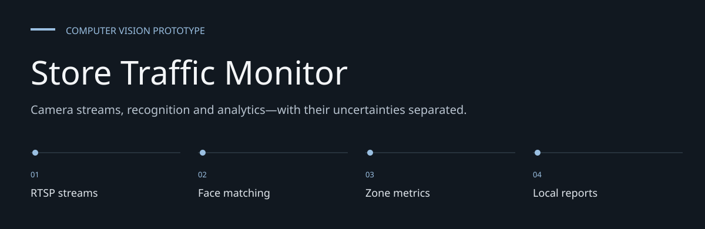
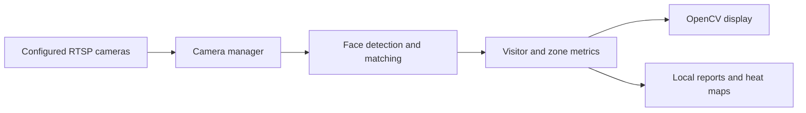

# Store Traffic Monitor

**Camera streams, recognition and analytics—with their uncertainties separated.**

A Python/OpenCV prototype combining IP-camera streams, face matching and store traffic analytics.
It includes both a multi-camera monitoring system and standalone face-recognition scripts.


[Architecture](docs/ARCHITECTURE.md) · [Evaluation guide](docs/EVALUATION.md)

**Contents:** [The challenge](#the-challenge) · [Walkthrough](#walk-through-the-project) ·
[Implementation](#implementation-state) · [Design choices](#engineering-choices) ·
[Next evidence](#next-evidence-to-collect)

---

## The challenge

Store traffic analysis involves stream availability, detections, identity matching and spatial
interpretation. This prototype combines those layers, but a visitor count or heat map is only as
reliable as the recognition and camera geometry feeding it.

## System at a glance


## Walk through the project

### 1. Configure a controlled camera

Supply authorized RTSP endpoints and zone boundaries. Review the connection diagnostics before
capturing data.

### 2. Inspect stream processing

The camera manager coordinates frames while the monitoring system processes and displays them.
Network reconnect behavior belongs to a different layer than recognition accuracy.

### 3. Review recognition records

Face matching can register visitors and save embeddings/CSV records. Existing artifacts are not a
labeled accuracy benchmark.

### 4. Check analytics output

Inspect dwell-time, zone and heat-map reports. Validate camera-to-store coordinates and false
matches before interpreting cross-camera behavior.

## Architecture



[StoreMonitoringSystem](store_monitoring_system.py) coordinates processing/display threads and
periodic analytics saves. [CameraManager](camera_manager.py) loads camera configuration and
manages streams. Recognition uses InsightFace and a FAISS matching index; visitor records
and embedding artifacts are stored locally.

## Setup

```bash
git clone https://github.com/DanushArun/facial_recognition_through_cctv.git
cd facial_recognition_through_cctv
python3 -m venv .venv
source .venv/bin/activate
python -m pip install -r requirements.txt
```

Configure your own cameras and zones using `setup_cameras.py`, `camera_config.json` and
`zone_config.json`. Camera hosts and credentials must belong to an authorized test environment.
Dependencies include model runtimes; GPU/runtime compatibility and model downloads need checking
on the target machine.

After reviewing configuration:

```bash
python setup_cameras.py
python store_monitoring_system.py
```

These commands can open camera connections and write recognition/analytics data.
They were not run for this documentation update.

## Outputs and diagnostic tools

- [traffic_analytics.py](traffic_analytics.py): zone tracking, dwell time and heat maps.
- [FaceRecognizer.py](FaceRecognizer.py): visitor registration and embedding matching.
- [test_camera_connection.py](test_camera_connection.py): camera connection diagnostics.
- [test_system_integration.py](test_system_integration.py): live integration diagnostic script.
- [flowchart.md](flowchart.md): recorded system diagram.

Analytics reports, heat-map images and traffic graphs are written under `analytics`.
The store monitor's configured save interval is 300 seconds.
The `test_*` scripts exercise hardware/network paths; they are not isolated unit tests.

## Evidence and limits

Source and dependencies were inspected. No CCTV access, face enrollment, biometric artifact
loading, hardware trial or recognition-accuracy evaluation was performed for this README.
Existing CSV/model/embedding artifacts are not a labeled benchmark proving matching reliability.
Load pickle artifacts only from a trusted source.

The prototype does not demonstrate validated identity accuracy, cross-camera calibration,
privacy compliance or deployment readiness. Evaluate with consenting participants and controlled
camera data, define retention/access controls and inspect false matches before operational use.

## Engineering choices

**Separate stream and recognition failures.** A connected camera is not proof of valid face
matching.

**Local artifact storage.** CSV and pickle outputs need explicit trust, access and retention
controls.

**Diagnostic tests are labeled.** Live camera scripts are not isolated unit tests.

## Implementation state

| State | Current evidence |
| --- | --- |
| Present | Stream management and recognition source |
| Present | Visitor metrics, report and heat-map generation |
| Requires hardware | Live camera and integration diagnostics |
| Not validated | Identity accuracy, calibration, privacy or production readiness |

The [architecture guide](docs/ARCHITECTURE.md) maps these statements to source entry points.
The [evaluation guide](docs/EVALUATION.md) separates inspection, executable checks and
domain validation, with the next evidence needed for each project.

## Next evidence to collect

- Evaluate controlled footage with consenting participants.
- Measure false matches and coordinate calibration.
- Establish retention, access and deployment controls.
