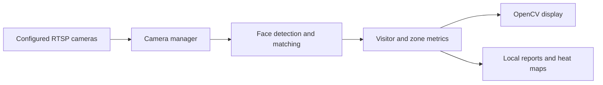

# Store Traffic Monitoring Prototype

A Python/OpenCV prototype combining IP-camera streams, face matching and store traffic analytics.
It includes both a multi-camera monitoring system and standalone face-recognition scripts.

## Architecture



[StoreMonitoringSystem](store_monitoring_system.py) coordinates processing/display threads and
periodic analytics saves. [CameraManager](camera_manager.py) loads camera configuration and
manages streams. Recognition uses InsightFace and a FAISS matching index; visitor records
and embedding artifacts are stored locally.

## Setup

```bash
git clone https://github.com/DanushArun/facial_recognition_through_cctv.git
cd facial_recognition_through_cctv
python3 -m venv .venv
source .venv/bin/activate
python -m pip install -r requirements.txt
```

Configure your own cameras and zones using `setup_cameras.py`, `camera_config.json` and
`zone_config.json`. Camera hosts and credentials must belong to an authorized test environment.
Dependencies include model runtimes; GPU/runtime compatibility and model downloads need checking
on the target machine.

After reviewing configuration:

```bash
python setup_cameras.py
python store_monitoring_system.py
```

These commands can open camera connections and write recognition/analytics data.
They were not run for this documentation update.

## Outputs and diagnostic tools

- [traffic_analytics.py](traffic_analytics.py): zone tracking, dwell time and heat maps.
- [FaceRecognizer.py](FaceRecognizer.py): visitor registration and embedding matching.
- [test_camera_connection.py](test_camera_connection.py): camera connection diagnostics.
- [test_system_integration.py](test_system_integration.py): live integration diagnostic script.
- [flowchart.md](flowchart.md): recorded system diagram.

Analytics reports, heat-map images and traffic graphs are written under `analytics`.
The store monitor's configured save interval is 300 seconds.
The `test_*` scripts exercise hardware/network paths; they are not isolated unit tests.

## Evidence and limits

Source and dependencies were inspected. No CCTV access, face enrollment, biometric artifact
loading, hardware trial or recognition-accuracy evaluation was performed for this README.
Existing CSV/model/embedding artifacts are not a labeled benchmark proving matching reliability.
Load pickle artifacts only from a trusted source.

The prototype does not demonstrate validated identity accuracy, cross-camera calibration,
privacy compliance or deployment readiness. Evaluate with consenting participants and controlled
camera data, define retention/access controls and inspect false matches before operational use.
